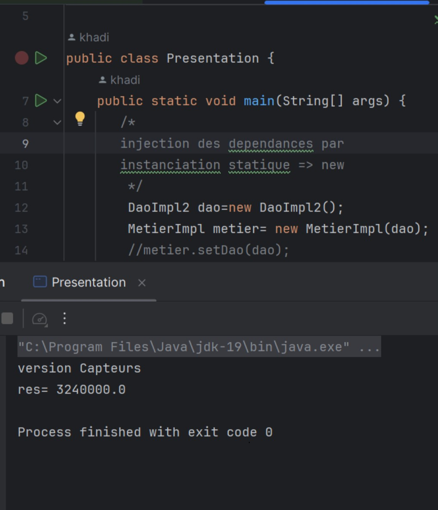
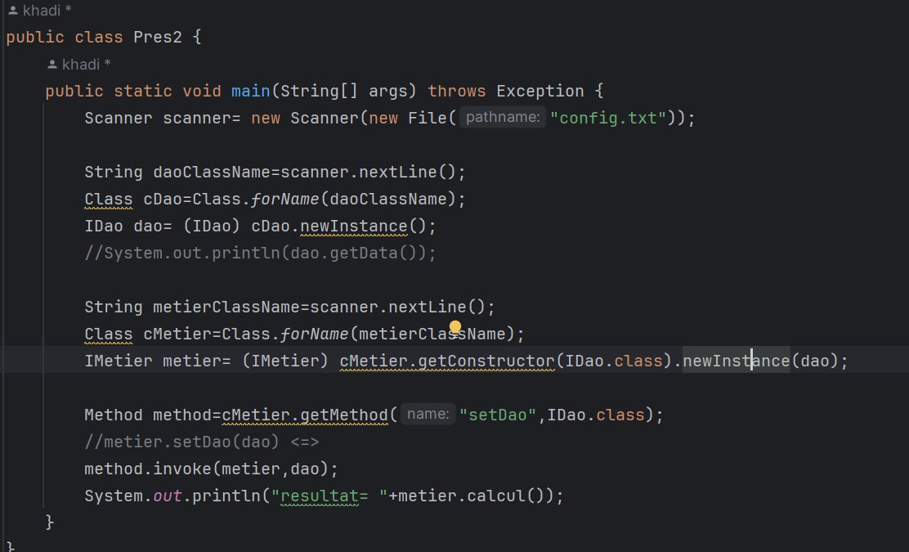
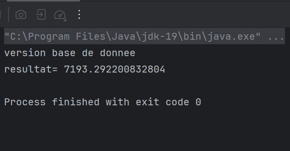
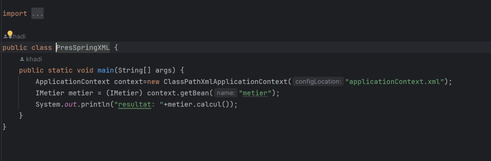
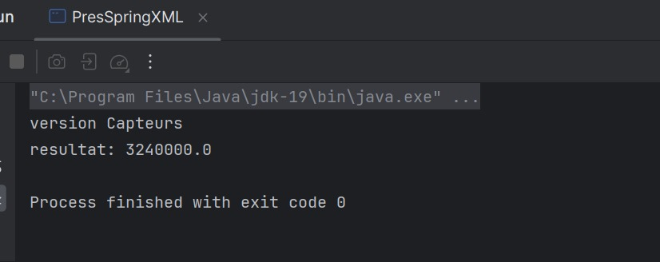
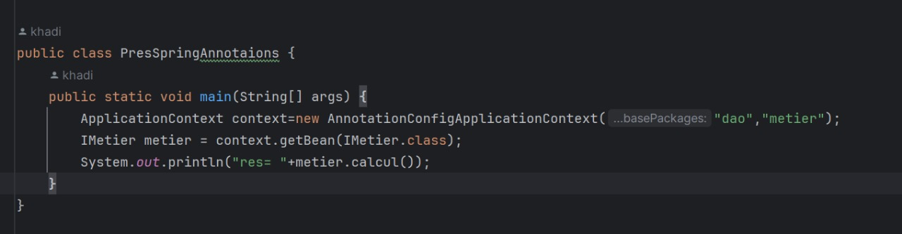
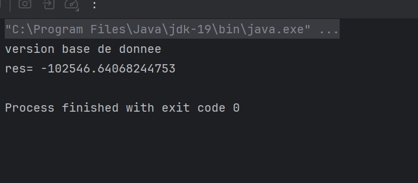

<h1 style="text-align: center; color: blue">Compte rendu</h1>
<h2 style="color:bisque; margin-left: 30px">sans utilisation de spring </h2>
<h3 style="text-align: left; color: cornflowerblue">1-injection des dependances avec instanciation statique:</h3>

<h3 style="text-align: left; color: cornflowerblue">2-injection des dependances avec instanciation dynamique:</h3>

<h3 style="text-align: left; color: cornflowerblue">execution:</h3>

<h2 style="color:bisque; margin-left: 30px">avec utilisation de spring </h2>
<h3 style="text-align: left; color: cornflowerblue">3-injection des dependances avec un fichier de configuration Xml:</h3>

<h3 style="text-align: left; color: cornflowerblue">execution:</h3>

<h3 style="text-align: left; color: cornflowerblue">4-injection des dependances avec via le constuteur:</h3>

<h3 style="text-align: left; color: cornflowerblue">execution:</h3>

